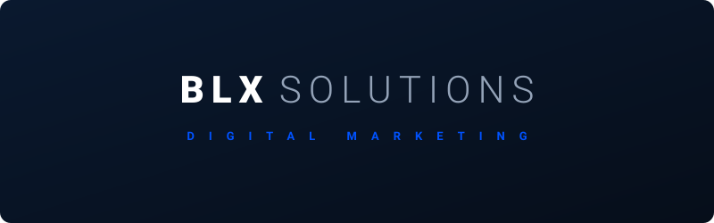

  

# BLX Solutions Website

Official website project for **BLX Solutions**.

> Websites and digital marketing for small local businesses.

## Current brand asset

The logo above is the current official BLX Solutions logo for this project. It is provisional and may be refined or replaced as the brand develops.

Source file: [assets/brand/blx-solutions-logo.svg](assets/brand/blx-solutions-logo.svg)

## Locked design direction

> **The Signal System, powered by BLX Compile transitions.**

The finished pages will use a clean bento-grid structure, expressive typography, restrained glass surfaces and purposeful micro-interactions. Technical complexity will be concentrated in the opening and page-transition experiences.

Guiding principle:

> **Visually simple. Technically sophisticated. Strategically clear.**

See the full [design direction](docs/DESIGN-DIRECTION.md).

## Project goals

- Build a polished website that immediately creates trust.
- Use futuristic animation and interaction without sacrificing clarity or speed.
- Showcase BLX Solutions' web-design and digital-marketing capability.
- Develop the project feature by feature as a practical coding-learning project.
- Keep the finished website maintainable and realistic to complete.

## Planned first version

- BLX Compile opening sequence
- High-impact kinetic homepage hero
- Bento-grid services overview
- Service-card-to-page Compile transitions
- Clear explanation of who BLX Solutions helps
- Selected work and portfolio section
- Simple working process
- Strong contact call to action
- Responsive, accessible and performance-conscious design

## Status

Foundation and design direction established. Development has not started.

See [the roadmap](docs/ROADMAP.md) for the suggested build order.
